# Evoke --- Frontend--Backend Contract & Architecture Specification

**Version:** 1.0\
**Status:** Architecture Baseline / Pre-Backend Implementation\
**Product:** Evoke Event Invitation Platform\
**Frontend:** Angular 20\
**Backend:** To be implemented\
**Identity Provider:** Supabase Auth (behind an `IdentityProvider` abstraction — swappable)\
**Primary Database:** PostgreSQL\
**Object Storage:** S3-compatible object storage\
**Audience:** Frontend, Backend, Platform, QA, Architecture

------------------------------------------------------------------------

# 1. Purpose

This document establishes the contract between the Evoke Angular
frontend and the future backend.

The goal is to ensure that backend implementation does not force major
frontend refactoring later.

The specification defines:

-   Domain boundaries.
-   Authentication boundaries.
-   API conventions.
-   Request/response contracts.
-   Identity model.
-   Wedding model.
-   Template model.
-   Draft model.
-   Media model.
-   Publishing model.
-   Public invitation model.
-   Authorization rules.
-   Error contracts.
-   Versioning strategy.
-   Persistence boundaries.
-   Frontend state ownership.
-   Backend ownership.
-   End-to-end flows.
-   Implementation order.
-   Architectural decisions.

This document should be treated as the **contractual baseline** for
backend implementation.

------------------------------------------------------------------------

# 2. Product Model

Evoke is not primarily a template editor.

The core product entity is a **Wedding/Event Project**.

The template is a presentation mechanism applied to that project.

The fundamental model is:

``` text
User
  |
  +---- Wedding / Event
            |
            +---- Template
            |
            +---- Template Version
            |
            +---- Draft Data
            |
            +---- Media Assets
            |
            +---- Published Version
                        |
                        +---- Public URL
                                  |
                                  +---- Guests
                                  |
                                  +---- RSVP
```

The architecture must support future event types:

``` text
Wedding
Engagement
Birthday
Baby Shower
Corporate Event
Conference
Party
Other Event
```

Therefore the backend should avoid embedding wedding-specific
assumptions into core infrastructure.

The initial product may expose only Wedding and Engagement, but the
domain should be capable of representing:

``` text
Event
```

as the general concept.

------------------------------------------------------------------------

# 3. Architecture Principles

## 3.1 Supabase Auth owns authentication

Supabase Auth owns:

-   Password authentication.
-   OAuth/OIDC.
-   Google login.
-   Future identity providers.
-   Password hashing.
-   Sessions.
-   Token issuance.
-   Refresh tokens.
-   Email verification.
-   Password reset.
-   MFA.
-   Brute-force protection.

The application must not reimplement these capabilities.

## 3.2 Auth Service owns the application identity boundary

The Auth Service provides:

``` text
Angular
   |
   v
Auth Service
   |
   v
Supabase Auth
```

The Auth Service is responsible for:

-   Request validation.
-   Application-specific authentication contract.
-   Supabase Auth orchestration.
-   Application user provisioning.
-   Identity mapping.
-   Application-level roles.
-   Current-user projection.

It must NOT become a second authentication server.

## 3.3 Backend owns business authorization

The frontend may hide UI based on permissions, but the backend is the
final authority.

``` text
Frontend authorization
    = UX

Backend authorization
    = Security
```

## 3.4 Wedding/Event is the primary business entity

The editor edits an Event/Wedding.

The template is selected by the event.

Therefore the long-term editor route should be:

``` text
/editor/:weddingId
```

rather than:

``` text
/editor/:templateId
```

## 3.5 Published content is immutable

A draft may change continuously.

A published version must remain stable.

``` text
Draft v17
    |
    v
Publish
    |
    v
Published v17
```

Later editing produces:

``` text
Draft v18
```

without changing:

``` text
Published v17
```

until v18 is explicitly published.

------------------------------------------------------------------------

## 3.6 Supabase Portability Boundary

Business logic (draft concurrency/409 handling, immutable publish
snapshots, template schema validation, billing/entitlement rules) lives
in the backend's own service code:

-   Not in vendor-specific serverless functions (avoid Supabase Edge
    Functions for this).
-   Not solely in DB triggers/RLS.
-   So it can run against any Postgres host.

Portability requirements:

-   Plain SQL migrations (or a standard framework-native migration
    tool), not a Supabase-CLI-only format.
-   Backend domain modules talk to Postgres via a normal connection
    string/ORM, not the Supabase client SDK. The Supabase JS SDK is
    acceptable only for the Angular Auth module's own login/session
    calls.
-   RLS policies may exist as defense-in-depth, mirroring the same
    RBAC + ownership rules already enforced in the backend, but the
    backend remains the authoritative enforcement point.

**Supabase Exit Strategy**

A future migration away from Supabase requires:

-   Swapping the `SupabaseIdentityProvider` / `SupabaseStorageProvider`
    adapters.
-   Repointing the Postgres connection string and re-running the same
    plain-SQL migrations.

It does NOT require:

-   Rewriting domain/business logic.
-   Changing the API contract.
-   Changing the frontend beyond its auth SDK initialization.

------------------------------------------------------------------------

# 4. Target System Architecture

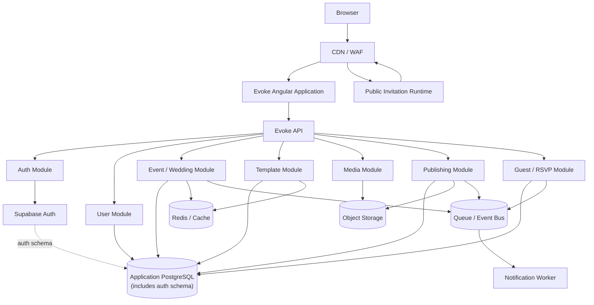

------------------------------------------------------------------------

# 5. Frontend Architecture

The existing frontend follows:

``` text
src/app/
├── core/
├── shared/
└── features/
```

The recommended evolution is:

``` text
src/app/
│
├── core/
│   ├── auth/
│   ├── config/
│   ├── http/
│   ├── layouts/
│   ├── platform/
│   ├── routing/
│   ├── seo/
│   └── theme/
│
├── shared/
│   ├── ui/
│   ├── directives/
│   ├── pipes/
│   └── validators/
│
└── features/
    ├── home/
    ├── auth/
    ├── dashboard/
    ├── events/
    ├── templates/
    ├── editor/
    ├── publishing/
    └── public-wedding/
```

The existing frontend does not need to implement all of these
immediately.

The structure defines the intended product boundary.

------------------------------------------------------------------------

# 6. Frontend ↔ Backend Boundary

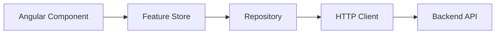

Components should not directly call backend endpoints.

Preferred:

``` text
DashboardComponent
      |
      v
DashboardStore
      |
      v
WeddingRepository
      |
      v
HTTP API
```

Avoid:

``` text
DashboardComponent
      |
      v
HttpClient.get(...)
```

------------------------------------------------------------------------

# 7. Domain Ownership Matrix

  ------------------------------------------------------------------------
  Domain            Frontend          Backend           Source of Truth
  ----------------- ----------------- ----------------- ------------------
  Authentication    Auth UI/State     Auth Service +    Supabase Auth
                                      Supabase Auth     

  Application User  User Store        User Module       Application DB

  Event/Wedding     Event Store       Event Module      Application DB

  Template Catalog  Template Store    Template Module   Backend/Template
                                                        Store

  Template Schema   Editor            Template Module   Template version

  Draft             Editor Store      Draft persistence Application DB

  Media             Media UI          Media Module      Object Storage +
                                                        DB metadata

  Publishing        Publish UI        Publishing Module Published version

  Public Wedding    Public Runtime    Public API/CDN    Published version

  RSVP              Guest UI          Guest/RSVP Module Application DB

  Analytics         Analytics UI      Analytics         Event/analytics
                                                        store
  ------------------------------------------------------------------------

------------------------------------------------------------------------

# 8. Identity Model

Supabase Auth is the identity authority.

The application maintains a local user projection.

``` text
Supabase Auth User
    |
    | auth_user_id
    v
Application User
    |
    +---- Events
    +---- Preferences
    +---- Roles
```

Application users should reference:

``` text
users.id
```

Business data must not use email addresses as foreign keys.

------------------------------------------------------------------------

# 9. User Model

Conceptual model:

``` json
{
  "id": "usr_123",
  "authUserId": "3fa85f64-5717-4562-b3fc-2c963f66afa6",
  "email": "user@example.com",
  "firstName": "Aarav",
  "lastName": "Sharma",
  "displayName": "Aarav Sharma",
  "avatarAssetId": "asset_123",
  "roles": ["USER"],
  "status": "ACTIVE",
  "profileCompleted": false,
  "createdAt": "2026-08-08T10:00:00Z",
  "updatedAt": "2026-08-08T10:00:00Z"
}
```

Roles should not be treated as the complete authorization model.

------------------------------------------------------------------------

# 10. Role Model

Initial roles:

``` text
USER
EDITOR
ADMIN
```

## USER

Can:

-   View public templates.
-   Create own events.
-   Edit own events.
-   Upload own media.
-   Publish own events.
-   Manage own guests.
-   View own RSVP data.

## EDITOR

> Reserved for a later phase. The current frontend implements only
> USER and ADMIN.

Can:

-   Create templates.
-   Edit templates.
-   Create template versions.
-   Publish template versions.
-   Perform approved content-management operations.

## ADMIN

Can:

-   Manage users.
-   Manage templates.
-   Manage platform configuration.
-   Manage operational resources.

------------------------------------------------------------------------

# 11. RBAC + Resource Ownership

Authorization must use:

``` text
Role
+
Resource ownership
+
Resource state
+
Operation
```

Example:

``` text
PATCH /v1/events/evt_123

Authenticated user
       |
       v
Role = USER
       |
       v
event.owner_id == user.id
       |
       v
event.status allows editing
       |
       v
ALLOW
```

A USER must not be able to edit another user's event.

RLS policies may mirror this model as defense-in-depth (see § 3.6
Supabase Portability Boundary), but this backend-enforced RBAC +
resource-ownership model remains authoritative.

------------------------------------------------------------------------

# 12. Authentication Architecture

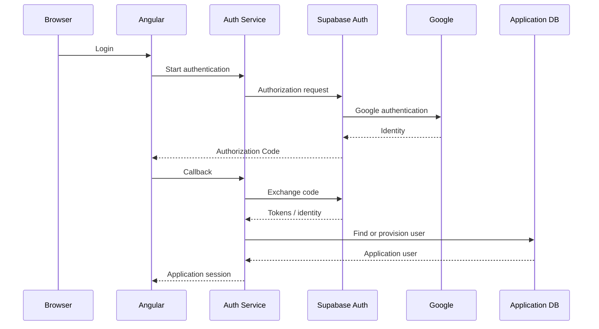

The exact browser/session mechanism must be chosen during
implementation, but the boundary must remain:

``` text
Angular
  ↓
Auth API
  ↓
Supabase Auth
```

------------------------------------------------------------------------

# 13. Authentication API Contract

## Start login

``` http
GET /v1/auth/login
```

Optional query:

``` text
provider=google
```

Response may be:

``` json
{
  "authorizationUrl": "https://..."
}
```

## OAuth callback

``` http
GET /v1/auth/callback
```

Parameters:

``` text
code
state
```

## Current user

``` http
GET /v1/auth/me
```

Response:

``` json
{
  "id": "usr_123",
  "email": "user@example.com",
  "displayName": "Aarav Sharma",
  "roles": ["USER"],
  "profileCompleted": false
}
```

## Logout

``` http
POST /v1/auth/logout
```

## Signup

``` http
POST /v1/auth/signup
```

Example:

``` json
{
  "email": "user@example.com",
  "password": "********",
  "firstName": "Aarav",
  "lastName": "Sharma"
}
```

The backend validates application-specific fields and delegates identity
creation to Supabase Auth.

------------------------------------------------------------------------

# 14. Authentication Rules

The Auth Service must not:

-   Store passwords.
-   Hash passwords.
-   Implement OAuth.
-   Sign access tokens.
-   Implement Google authentication.
-   Implement refresh-token cryptography.
-   Replace Supabase Auth sessions.

The Auth Service may:

-   Validate application input.
-   Map application fields.
-   Provision application users.
-   Assign application roles.
-   Expose application-specific authentication APIs.

------------------------------------------------------------------------

# 15. Auth State in Angular

Recommended:

``` typescript
type AuthStatus =
  | 'unknown'
  | 'loading'
  | 'authenticated'
  | 'unauthenticated'
  | 'error';
```

Auth state:

``` text
AuthStore
├── status
├── user
├── roles
└── session
```

The auth guard should consume this state.

------------------------------------------------------------------------

# 16. API Versioning

All APIs should start with:

``` text
/v1
```

Examples:

``` text
/v1/auth
/v1/users
/v1/events
/v1/templates
/v1/media
/v1/publishing
/v1/public
/v1/rsvps
```

Breaking changes require:

``` text
/v2
```

Non-breaking additions remain in v1.

------------------------------------------------------------------------

# 17. API Response Convention

Successful single resource:

``` json
{
  "data": {
    "id": "evt_123"
  }
}
```

Collection:

``` json
{
  "data": [],
  "pagination": {
    "page": 1,
    "pageSize": 20,
    "total": 100
  }
}
```

The exact envelope can be simplified if the backend framework already
has a strong convention, but it must be consistent.

------------------------------------------------------------------------

# 18. Error Contract

All API errors should have a predictable shape:

``` json
{
  "error": {
    "code": "EVENT_NOT_FOUND",
    "message": "The requested event was not found.",
    "requestId": "req_123",
    "details": {}
  }
}
```

Frontend maps:

``` text
HTTP error
   ↓
Error Interceptor
   ↓
ApiError
   ↓
Feature-specific UX
```

The frontend should never display raw backend stack traces.

------------------------------------------------------------------------

# 19. HTTP Status Conventions

  Situation                       Status
  ----------------------------- --------
  Success                            200
  Created                            201
  Accepted                           202
  No content                         204
  Invalid request                    400
  Authentication required            401
  Authenticated but forbidden        403
  Resource not found                 404
  Conflict                           409
  Validation failure                 422
  Rate limited                       429
  Server failure                     500

------------------------------------------------------------------------

# 20. Event / Wedding Domain

The frontend should eventually operate against an Event model.

Example:

``` json
{
  "id": "evt_123",
  "type": "WEDDING",
  "ownerId": "usr_123",
  "title": "Aarav & Diya",
  "slug": "aarav-and-diya",
  "status": "DRAFT",
  "templateId": "tpl_royal",
  "templateVersion": 3,
  "schemaVersion": 2,
  "createdAt": "2026-08-08T10:00:00Z",
  "updatedAt": "2026-08-08T10:10:00Z"
}
```

Wedding-specific data should remain extensible.

------------------------------------------------------------------------

# 21. Event Data

Recommended structure:

``` text
Event
├── identity
├── type
├── owner
├── branding
├── content
├── events
├── template
├── media references
├── guests
└── publishing
```

Do not put all domain concepts into one giant JSON document without a
reason.

A hybrid model is recommended:

``` text
Relational fields
+
JSONB for template-driven content
```

------------------------------------------------------------------------

# 22. Event APIs

## Create

``` http
POST /v1/events
```

``` json
{
  "type": "WEDDING",
  "title": "Aarav & Diya"
}
```

## List

``` http
GET /v1/events
```

## Get

``` http
GET /v1/events/{eventId}
```

## Update

``` http
PATCH /v1/events/{eventId}
```

## Delete/archive

``` http
DELETE /v1/events/{eventId}
```

The backend must enforce ownership.

------------------------------------------------------------------------

# 23. Frontend Dashboard Contract

Dashboard should consume:

``` http
GET /v1/events
```

Example response:

``` json
{
  "data": [
    {
      "id": "evt_123",
      "type": "WEDDING",
      "title": "Aarav & Diya",
      "status": "DRAFT",
      "templateId": "tpl_royal",
      "thumbnailUrl": "https://cdn.example.com/...",
      "updatedAt": "2026-08-08T10:10:00Z"
    }
  ],
  "pagination": {
    "page": 1,
    "pageSize": 20,
    "total": 1
  }
}
```

The dashboard should not download the entire event content for every
card.

------------------------------------------------------------------------

# 24. Template Domain

A template consists of:

``` text
Template
├── Metadata
├── Version
├── Schema
├── Defaults
├── Capabilities
├── Runtime
└── Assets
```

The backend should distinguish:

``` text
Template
Template Version
Template Schema
Template Runtime
```

------------------------------------------------------------------------

# 25. Template Versioning

Three independent versions should be tracked:

``` text
templateVersion
schemaVersion
protocolVersion
```

Example:

``` json
{
  "templateId": "tpl_royal",
  "templateVersion": 4,
  "schemaVersion": 2,
  "protocolVersion": 1
}
```

Reason:

A visual redesign does not necessarily change the data contract.

A data contract change does not necessarily change the iframe protocol.

------------------------------------------------------------------------

# 26. Template Manifest

Conceptually:

``` json
{
  "id": "tpl_royal",
  "name": "Royal Wedding",
  "category": "Wedding",
  "templateVersion": 4,
  "schemaVersion": 2,
  "protocolVersion": 1,
  "bindingMode": "explicit",
  "capabilities": {
    "gallery": true,
    "audio": true,
    "countdown": true,
    "rsvp": true,
    "map": true
  },
  "previewUrl": "...",
  "schemaUrl": "...",
  "defaultsUrl": "...",
  "pricing": {
    "pricingModel": "PAID",
    "priceAmountMinor": 49900,
    "currency": "INR",
    "storefrontStatus": "LISTED"
  }
}
```

------------------------------------------------------------------------

# 27. Template APIs

## List templates

``` http
GET /v1/templates
```

Supports:

``` text
category
search
sort
page
pageSize
```

## Get template

``` http
GET /v1/templates/{templateId}
```

## Get version

``` http
GET /v1/templates/{templateId}/versions/{version}
```

## Create template

``` http
POST /v1/templates
```

EDITOR/ADMIN only.

## Create version

``` http
POST /v1/templates/{templateId}/versions
```

EDITOR/ADMIN only.

## Publish template version

``` http
POST /v1/templates/{templateId}/versions/{version}/publish
```

EDITOR/ADMIN only.

------------------------------------------------------------------------

# 28. Template Gallery Contract

The Angular template gallery needs lightweight metadata:

``` json
{
  "id": "tpl_royal",
  "name": "Royal Wedding",
  "category": "Wedding",
  "thumbnailUrl": "...",
  "previewUrl": "...",
  "currentVersion": 4,
  "capabilities": [
    "gallery",
    "audio",
    "rsvp"
  ]
}
```

Do not send:

-   Complete schema.
-   Defaults.
-   Runtime code.

until the editor actually needs them.

------------------------------------------------------------------------

# 29. Editor Architecture

The editor should eventually be:

``` text
/editor/:eventId
```

Flow:

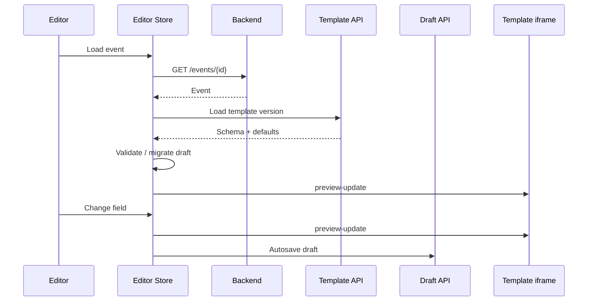

------------------------------------------------------------------------

# 30. Editor Store Ownership

`TemplateEditorStore` remains the single source of truth for the current
editing session.

It owns:

``` text
active template
template version
schema
schema version
template data
dirty state
validation state
save state
publish state
```

It does not own:

``` text
Supabase Auth session
Global theme
Dashboard state
All events
```

------------------------------------------------------------------------

# 31. Draft Contract

Draft persistence:

``` http
GET /v1/events/{eventId}/draft
```

``` http
PUT /v1/events/{eventId}/draft
```

Example:

``` json
{
  "templateId": "tpl_royal",
  "templateVersion": 4,
  "schemaVersion": 2,
  "data": {
    "couple": {
      "brideName": "Diya",
      "groomName": "Aarav"
    }
  },
  "revision": 17
}
```

------------------------------------------------------------------------

# 32. Optimistic Concurrency

Draft updates should carry a revision.

``` text
Client has revision 17
        |
        v
PUT revision 17
        |
        v
Backend accepts
        |
        v
revision 18
```

If another writer already changed it:

``` text
Client revision 17
Backend revision 19
        |
        v
409 CONFLICT
```

The frontend can then:

``` text
Reload
Compare
Resolve
```

This becomes important if multiple tabs or future collaboration is
introduced.

------------------------------------------------------------------------

# 33. Autosave

Frontend:

``` text
Field change
    ↓
Signal update
    ↓
800ms debounce
    ↓
deduplicate
    ↓
PUT draft
```

Backend:

-   Validate event ownership.
-   Validate template/schema version.
-   Validate payload.
-   Apply optimistic concurrency.
-   Persist revision.
-   Return new revision.

------------------------------------------------------------------------

# 34. Draft Migration

When loading a draft:

``` text
Draft schemaVersion
        |
        v
Current schemaVersion
```

Cases:

``` text
same
  → use directly

older
  → execute migration

newer
  → reject / require compatible client

invalid
  → recover safely
```

Never silently reinterpret incompatible data.

------------------------------------------------------------------------

# 35. Media Contract

Frontend must not upload large files through the main API server.

Preferred:

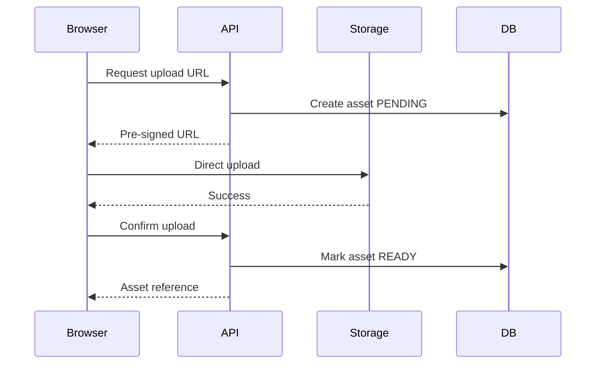

------------------------------------------------------------------------

# 36. Media Asset Model

``` json
{
  "id": "asset_123",
  "eventId": "evt_123",
  "kind": "IMAGE",
  "status": "READY",
  "contentType": "image/webp",
  "width": 1920,
  "height": 1080,
  "url": "https://cdn.example.com/asset_123.webp",
  "createdAt": "2026-08-08T10:00:00Z"
}
```

Template data should reference:

``` json
{
  "assetId": "asset_123"
}
```

rather than storing large base64 strings.

------------------------------------------------------------------------

# 37. Storage Provider Abstraction

Media and other binary assets must be reached through a storage
abstraction, not the Supabase client directly, so the backend can move
to any S3-compatible provider without touching domain code.

``` typescript
interface StorageProvider {
  createUploadUrl(input: CreateUploadRequest): Promise<PresignedUpload>;
  confirmUpload(assetId: string): Promise<MediaAsset>;
  getPublicUrl(assetId: string): Promise<string>;
  delete(assetId: string): Promise<void>;
}
```

Initial implementation: `SupabaseStorageProvider` (Supabase Storage,
which is itself S3-compatible).

Backend domain modules depend on `StorageProvider`, never on
`@supabase/storage-js` directly.

------------------------------------------------------------------------

# 38. Publishing Architecture

Publishing must create a stable snapshot.

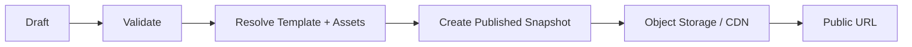

------------------------------------------------------------------------

# 39. Publish API

``` http
POST /v1/events/{eventId}/publish
```

Response:

``` json
{
  "data": {
    "eventId": "evt_123",
    "publishedVersion": 18,
    "url": "https://evoke.example.com/w/aarav-and-diya",
    "publishedAt": "2026-08-08T12:00:00Z"
  }
}
```

------------------------------------------------------------------------

# 40. Publishing Rules

Backend must:

1.  Authenticate user.
2.  Authorize event ownership.
3.  Validate event.
4.  Validate template version.
5.  Validate template data.
6.  Verify template entitlement for `PAID` templates; reject with
    `TEMPLATE_NOT_ENTITLED` if the user holds no matching entitlement.
7.  Resolve required media.
8.  Create immutable published snapshot.
9.  Update published pointer.
10. Invalidate CDN/cache where required.
11. Return public URL.

------------------------------------------------------------------------

# 41. Public Wedding API

Public wedding pages do not require Supabase Auth.

``` http
GET /v1/public/weddings/{slug}
```

Response should be optimized for rendering:

``` json
{
  "data": {
    "slug": "aarav-and-diya",
    "template": {
      "id": "tpl_royal",
      "version": 4,
      "runtimeUrl": "..."
    },
    "data": {},
    "seo": {
      "title": "Aarav & Diya",
      "description": "...",
      "imageUrl": "...",
      "canonicalUrl": "..."
    }
  }
}
```

------------------------------------------------------------------------

# 42. Public Runtime

The public invitation runtime should not require:

``` text
Supabase Auth
Dashboard API
Editor API
Authenticated session
```

It should depend only on:

``` text
Published wedding
Template runtime
Public assets
```

------------------------------------------------------------------------

# 43. Public Traffic Architecture

``` text
Guest
  |
  v
CDN
  |
  +---- cache hit → published wedding
  |
  +---- cache miss
             |
             v
        Public API
             |
             v
      Published snapshot
```

Public wedding traffic is expected to exceed authenticated platform
traffic.

------------------------------------------------------------------------

# 44. RSVP Contract

Public RSVP:

``` http
POST /v1/public/weddings/{slug}/rsvp
```

Example:

``` json
{
  "guestName": "Rahul",
  "email": "rahul@example.com",
  "response": "ATTENDING",
  "guestCount": 2,
  "message": "Looking forward to it!"
}
```

The backend must:

-   Validate input.
-   Rate-limit.
-   Prevent abuse.
-   Associate RSVP with the correct published event.
-   Avoid trusting user-provided event IDs.

------------------------------------------------------------------------

# 45. Authenticated RSVP Management

``` http
GET /v1/events/{eventId}/rsvps
```

``` http
PATCH /v1/events/{eventId}/rsvps/{rsvpId}
```

Only authorized event owners/editors should access this data.

------------------------------------------------------------------------

# 46. Billing & Commerce Domain

## Vocabulary

The frontend's `InvitationSite` is a UI-facing dashboard projection of
an `Event`, its `PUBLISHED_EVENT` pointer, and lightweight analytics
counters. It is not a separate backend entity.

``` text
InvitationSite (frontend view)
  = Event
  + PUBLISHED_EVENT pointer
  + view/RSVP counters
```

## View Counters

`views` is a lightweight, eventually-consistent counter.

-   Incremented asynchronously (e.g. via queue/worker), never inline
    in the public render path.
-   Never incremented inside the transactional publish/draft write
    path.
-   Read with relaxed consistency; approximate values are acceptable.

## Template Commercial Fields

`TEMPLATE` gains commercial fields, distinct from its existing
`status` (content/version readiness):

``` text
pricingModel      FREE | PAID
priceAmountMinor  integer
currency          char(3), default INR
storefrontStatus  LISTED | UNLISTED
```

`status` governs whether a template version is ready to be used by the
editor. `storefrontStatus` governs whether it is discoverable/sellable
in the gallery. The two are independent.

## Payment Model

``` json
{
  "id": "pay_123",
  "userId": "usr_123",
  "templateId": "tpl_royal",
  "eventId": null,
  "amountMinor": 49900,
  "currency": "INR",
  "status": "SUCCEEDED",
  "provider": "RAZORPAY",
  "providerReference": "pay_rzp_abc",
  "method": "UPI",
  "invoiceNumber": "INV-2026-000123",
  "createdAt": "2026-08-08T10:00:00Z",
  "updatedAt": "2026-08-08T10:00:05Z"
}
```

`status`: `PENDING | SUCCEEDED | FAILED | REFUNDED`.

Payments are only ever read/written through a `PaymentProvider`
interface, never called directly from domain modules.

``` typescript
interface PaymentProvider {
  createCheckoutSession(
    input: CreateCheckoutRequest
  ): Promise<CheckoutSession>;
  handleWebhook(
    rawEvent: unknown,
    signature: string
  ): Promise<PaymentEvent>;
  refund(paymentId: string): Promise<Payment>;
}
```

Initial implementation may wrap Razorpay/Stripe; domain code depends
only on `PaymentProvider`.

## Entitlement Model

``` json
{
  "id": "ent_123",
  "userId": "usr_123",
  "templateId": "tpl_royal",
  "source": "PURCHASE",
  "paymentId": "pay_123",
  "grantedAt": "2026-08-08T10:00:05Z"
}
```

`source`: `PURCHASE | FREE | PROMO`.

A user must hold an `ENTITLEMENT` for a `PAID` template before
publishing an event that uses it (see Publishing Rules,
`TEMPLATE_NOT_ENTITLED`).

## Billing APIs

``` http
PATCH /v1/templates/{id}
```

ADMIN-only commercial fields: `pricingModel`, `priceAmount`,
`storefrontStatus`.

``` http
POST /v1/payments/checkout
```

``` http
POST /v1/payments/webhook
```

``` http
GET /v1/users/me/entitlements
```

``` http
GET /v1/admin/metrics
```

``` http
GET /v1/admin/customers
```

## Admin Analytics Are Computed

`AdminMetric` (aggregate revenue/customers/RSVPs) and `AdminCustomer`
(plan, revenue) must be produced by read queries or materialized views
over `users`, `events`, and `payments` — not hand-maintained aggregate
tables that can drift from source data.

------------------------------------------------------------------------

# 47. Database Baseline

Recommended initial relational model:

``` text
users
events
event_versions
templates
template_versions
drafts
media_assets
published_events
guests
rsvps
payments
entitlements
audit_logs
```

Potential future:

``` text
organizations
organization_members
subscriptions
notifications
analytics_events
```

Do not introduce future tables until required.

------------------------------------------------------------------------

# 48. Core Relationships

``` mermaid
erDiagram

    USER ||--o{ EVENT : owns

    EVENT ||--o{ DRAFT : has

    EVENT ||--o{ EVENT_VERSION : has

    TEMPLATE ||--o{ TEMPLATE_VERSION : has

    EVENT }o--|| TEMPLATE_VERSION : uses

    EVENT ||--o{ MEDIA_ASSET : owns

    EVENT ||--o{ GUEST : has

    GUEST ||--o{ RSVP : submits

    EVENT ||--o{ PUBLISHED_EVENT : publishes

    USER ||--o{ PAYMENT : makes

    USER ||--o{ ENTITLEMENT : holds

    TEMPLATE ||--o{ ENTITLEMENT : "grants access to"

    PAYMENT ||--o| ENTITLEMENT : grants

    USER {
        uuid id PK
        uuid auth_user_id
        string email
        string status
    }

    EVENT {
        uuid id PK
        uuid owner_id FK
        string type
        string title
        string slug
        string status
    }

    DRAFT {
        uuid id PK
        uuid event_id FK
        int revision
        int schema_version
        jsonb data
    }

    EVENT_VERSION {
        uuid id PK
        uuid event_id FK
        int version
        jsonb data
    }

    TEMPLATE {
        uuid id PK
        string slug
        string name
        string category
        string pricing_model
        int price_amount_minor
        string currency
        string storefront_status
    }

    TEMPLATE_VERSION {
        uuid id PK
        uuid template_id FK
        int version
        int schema_version
        int protocol_version
        jsonb schema
    }

    MEDIA_ASSET {
        uuid id PK
        uuid event_id FK
        string object_key
        string status
    }

    PUBLISHED_EVENT {
        uuid id PK
        uuid event_id FK
        int version
        string public_slug
    }

    GUEST {
        uuid id PK
        uuid event_id FK
        string name
        string email
    }

    RSVP {
        uuid id PK
        uuid guest_id FK
        string response
    }

    PAYMENT {
        uuid id PK
        uuid user_id FK
        uuid template_id FK
        uuid event_id FK
        int amount_minor
        string currency
        string status
        string provider
        string provider_reference
        string invoice_number
    }

    ENTITLEMENT {
        uuid id PK
        uuid user_id FK
        uuid template_id FK
        string source
        uuid payment_id FK
    }
```

------------------------------------------------------------------------

# 49. Important Database Decision

Do not store:

``` text
Supabase Auth password
OAuth tokens
Access tokens
Refresh tokens
```

in the application database unless there is a very specific, reviewed
reason.

The application stores:

``` text
auth_user_id
```

and application-specific user data.

------------------------------------------------------------------------

# 50. JSONB Usage

Template-driven content is a strong candidate for JSONB.

Example:

``` text
draft.data
published_event.data
template_version.schema
template_version.defaults
```

But relational entities should remain relational when they require:

-   Foreign keys.
-   Queries.
-   Constraints.
-   Aggregation.
-   Authorization.

Do not turn the entire database into JSONB.

------------------------------------------------------------------------

# 51. Repository Contracts

Frontend repositories should align with backend domain APIs.

## WeddingRepository

``` typescript
interface WeddingRepository {
  list(): Observable<WeddingSummary[]>;
  getById(id: string): Observable<Wedding>;
  create(input: CreateWedding): Observable<Wedding>;
  update(id: string, input: UpdateWedding): Observable<Wedding>;
  delete(id: string): Observable<void>;
}
```

## DraftRepository

``` typescript
interface DraftRepository {
  get(eventId: string): Observable<DraftDocument>;
  save(
    eventId: string,
    document: DraftDocument,
    revision: number
  ): Observable<DraftDocument>;
}
```

## TemplateRepository

``` typescript
interface TemplateRepository {
  list(query: TemplateQuery): Observable<TemplateSummary[]>;
  get(id: string): Observable<Template>;
  getVersion(
    id: string,
    version: number
  ): Observable<TemplateVersion>;
}
```

## PublishingRepository

``` typescript
interface PublishingRepository {
  publish(eventId: string): Observable<PublishedEvent>;
}
```

------------------------------------------------------------------------

# 52. Frontend State Ownership

  State              Owner
  ------------------ ----------------------
  Authentication     AuthStore
  Current user       AuthStore/UserStore
  Dashboard events   DashboardStore
  Current event      EventStore
  Template gallery   TemplateGalleryStore
  Editor data        TemplateEditorStore
  Publish state      PublishingStore
  Theme              ThemeService
  Viewport           ViewportService
  Temporary modal    Component
  Public wedding     PublicWeddingStore

Avoid one global application store.

------------------------------------------------------------------------

# 53. API Loading/Error State

Every async feature should distinguish:

``` text
idle
loading
success
empty
error
```

Avoid using:

``` typescript
isLoading = true/false
```

as the only representation of state.

This is particularly important for:

``` text
Dashboard
Template gallery
Editor hydration
Draft save
Media upload
Publishing
RSVP
```

------------------------------------------------------------------------

# 54. Security Contract

## Frontend

Responsible for:

-   UX authorization.
-   Route guards.
-   Hiding unavailable actions.
-   Input validation for user experience.
-   Safe rendering.

## Backend

Responsible for:

-   Authentication.
-   Authorization.
-   Ownership checks.
-   Input validation.
-   Data validation.
-   Rate limiting.
-   Resource access.
-   Business rules.

Never trust:

``` text
frontend role
frontend eventId
frontend ownerId
frontend permissions
```

------------------------------------------------------------------------

# 55. Template Security Boundary

Templates are trusted platform code.

User content is untrusted data.

``` text
Trusted
----------------
Template runtime
Template JS
Template CSS
Template schema

Untrusted
----------------
Names
Descriptions
Images
URLs
Guest messages
User HTML/content
```

User data must never become executable JavaScript.

------------------------------------------------------------------------

# 56. iframe Security

Production should use a configured template origin.

Do not use:

``` javascript
postMessage(message, '*')
```

Production should use:

``` text
Configured trusted origin
```

Incoming messages must validate:

``` text
event.origin
event.source
channel
protocolVersion
payload
```

Prefer hosting templates on a separate origin where practical.

------------------------------------------------------------------------

# 57. API Security

All authenticated API requests must validate:

``` text
issuer
audience
signature
expiration
algorithm
subject
roles
```

JWTs should generally be validated locally using Supabase's public
signing keys (JWKS) rather than calling Supabase for every API request.

------------------------------------------------------------------------

# 58. Rate Limiting

Rate limiting is required for:

``` text
Login
Signup
Password reset
Public RSVP
Public API
Media upload initiation
Publishing
```

Public endpoints should have stricter limits.

------------------------------------------------------------------------

# 59. Observability Contract

Every backend request should support:

``` text
requestId
traceId
userId
eventId
templateId
```

when available.

Example:

``` text
POST /v1/events/evt_123/publish

requestId = req_123
traceId = trace_456
userId = usr_123
eventId = evt_123
templateId = tpl_royal
```

Frontend should send/request correlation identifiers where appropriate.

------------------------------------------------------------------------

# 60. Logging Rules

Never log:

``` text
password
access token
refresh token
client secret
OAuth authorization code
sensitive guest information unnecessarily
```

Logs should contain enough identifiers to trace a request without
leaking credentials.

------------------------------------------------------------------------

# 61. Caching

Use Redis for:

``` text
Template catalog
Template metadata
Public wedding metadata
Rate limiting
Short-lived application state
```

Redis is not the source of truth.

``` text
PostgreSQL = Source of truth
Redis = Performance layer
CDN = Public content acceleration
```

------------------------------------------------------------------------

# 62. Cache Strategy

Authenticated dashboard:

``` text
Short-lived / user-specific
```

Template catalog:

``` text
Longer TTL
Invalidate on template publication
```

Public wedding:

``` text
Aggressive CDN caching
Invalidate on publish
```

------------------------------------------------------------------------

# 63. Template Deployment Evolution

MVP:

``` text
Angular
  +
public/invitation-templates
```

Future:

``` text
Template Service
      |
      v
Object Storage
      |
      v
CDN
      |
      v
iframe
```

Angular deployment and template deployment should eventually become
independent.

------------------------------------------------------------------------

# 64. Public Invitation Architecture

Recommended future structure:

``` text
apps/
├── evoke-platform/
└── invitation-runtime/
```

The platform application handles:

``` text
Marketing
Authentication
Dashboard
Template Gallery
Editor
Publishing
```

The invitation runtime handles:

``` text
Published wedding
Template rendering
Guest experience
RSVP
SEO
```

This separation is not mandatory for MVP but should remain an
architectural option.

------------------------------------------------------------------------

# 65. End-to-End Create Wedding Flow

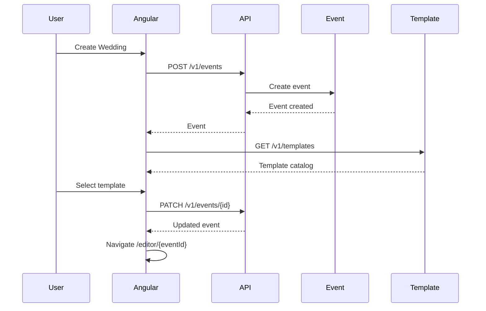

------------------------------------------------------------------------

# 66. End-to-End Editor Flow

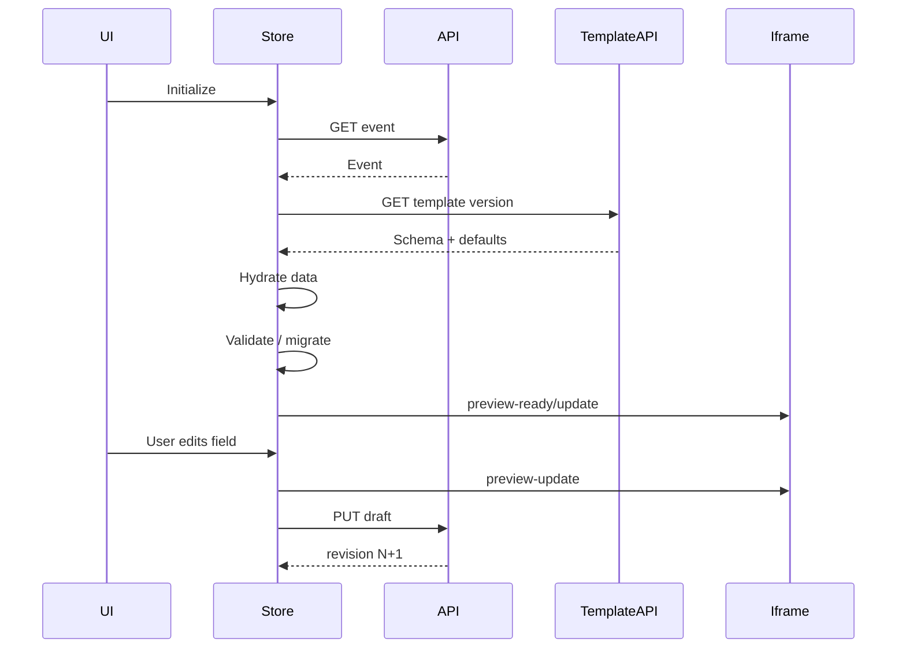

------------------------------------------------------------------------

# 67. End-to-End Publish Flow

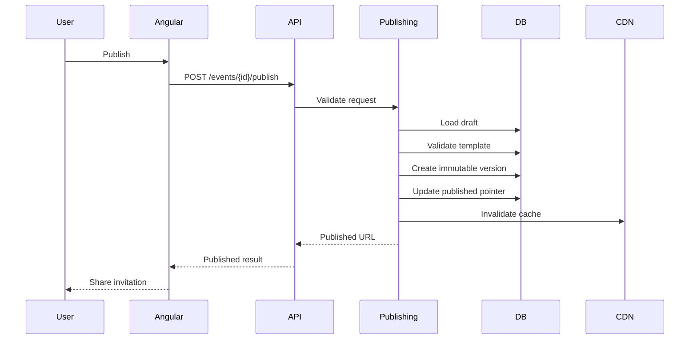

------------------------------------------------------------------------

# 68. End-to-End Guest Flow

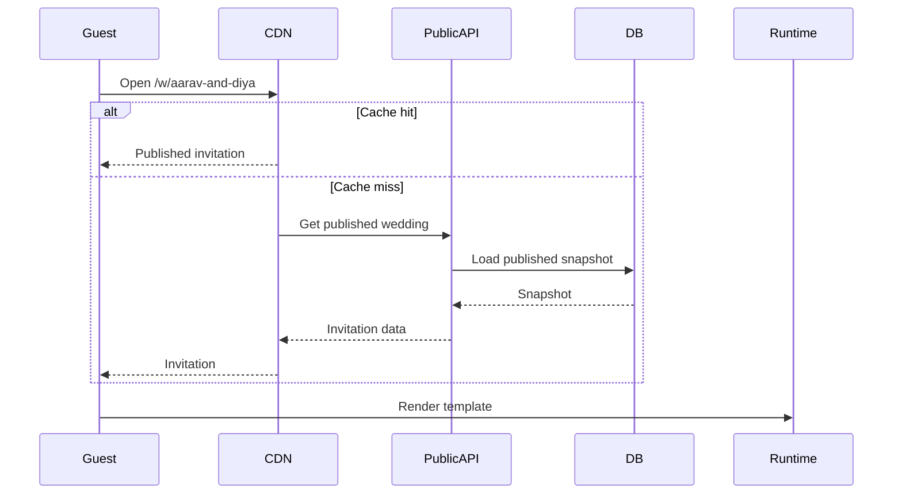

------------------------------------------------------------------------

# 69. Frontend Route Contract

Recommended:

``` text
/
├── /login
├── /signup
├── /auth/callback
│
├── /dashboard
├── /dashboard/events
├── /dashboard/settings
│
├── /templates
├── /templates/:templateId
│
├── /editor/:eventId
├── /publish/:eventId
│
└── /w/:slug
```

Protected:

``` text
/dashboard/*
/editor/*
/publish/*
```

Public:

``` text
/
/login
/signup
/templates/*
/w/*
```

------------------------------------------------------------------------

# 70. API Contract Matrix

  -----------------------------------------------------------------------------------------
  Frontend Feature  API                                 Auth              Primary Entity
  ----------------- ----------------------------------- ----------------- -----------------
  Login             `/v1/auth/*`                        Public/flow       Identity

  Dashboard         `/v1/events`                        Required          Event

  Event detail      `/v1/events/{id}`                   Required          Event

  Template gallery  `/v1/templates`                     Public            Template

  Template detail   `/v1/templates/{id}`                Public            Template

  Editor            `/v1/events/{id}`                   Required          Event

  Draft             `/v1/events/{id}/draft`             Required          Draft

  Media             `/v1/media/*`                       Required          Asset

  Publish           `/v1/events/{id}/publish`           Required          Published Event

  Public invitation `/v1/public/weddings/{slug}`        Public            Published Event

  RSVP              `/v1/public/weddings/{slug}/rsvp`   Public            RSVP

  RSVP management   `/v1/events/{id}/rsvps`             Required          RSVP

  Payments checkout `/v1/payments/checkout`             Required          Payment

  Payments webhook  `/v1/payments/webhook`              Public/Signed     Payment

  Entitlements      `/v1/users/me/entitlements`         Required          Entitlement

  Admin metrics     `/v1/admin/metrics`                 Required (ADMIN)  Metric

  Admin customers   `/v1/admin/customers`               Required (ADMIN)  Customer
  -----------------------------------------------------------------------------------------

------------------------------------------------------------------------

# 71. What Must NOT Happen

## Do not couple frontend directly to the Supabase client SDK for business logic

Bad:

``` text
Angular
  ↓
Supabase JS SDK for business data everywhere
```

Preferred:

``` text
Angular
  ↓
Auth API
  ↓
Supabase Auth
```

The Supabase JS SDK is acceptable only for the Auth module's own
login/session calls, not for reading or writing business data directly
from components.

## Do not couple editor to template ID

Bad:

``` text
/editor/:templateId
```

Long-term:

``` text
/editor/:eventId
```

## Do not store large media in TemplateData

Bad:

``` json
{
  "photo": "data:image/png;base64,..."
}
```

Good:

``` json
{
  "photo": {
    "assetId": "asset_123"
  }
}
```

## Do not expose drafts publicly

Only published snapshots are public.

## Do not let templates access private APIs

Templates should receive only the data required for rendering.

------------------------------------------------------------------------

# 72. Architecture Evolution

## Phase 1 --- Foundation

Implement:

``` text
Supabase Auth
Auth Service
User Module
PostgreSQL
API foundation
```

## Phase 2 --- Core Product

Implement:

``` text
Event/Wedding Module
Template Module
Draft persistence
Angular dashboard
Angular auth
```

## Phase 3 --- Media

Implement:

``` text
Object storage
Presigned uploads
Asset processing
CDN
```

## Phase 4 --- Publishing

Implement:

``` text
Published snapshots
Public wedding API
Public invitation runtime
SEO
CDN caching
```

## Phase 5 --- Engagement

Implement:

``` text
Guests
RSVP
Notifications
Analytics
```

## Phase 6 --- Scale

Only when justified:

``` text
Queue
Workers
Dedicated services
Template CDN
Dedicated public runtime
Advanced analytics
Organizations
Subscriptions
```

------------------------------------------------------------------------

# 73. Backend Implementation Order

The backend should be implemented in this order:

``` text
1. Project foundation
       ↓
2. PostgreSQL + migrations
       ↓
3. Supabase Auth integration
       ↓
4. Auth Service
       ↓
5. User provisioning
       ↓
6. Event/Wedding domain
       ↓
7. Template domain
       ↓
8. Draft persistence
       ↓
9. Media uploads
       ↓
10. Publishing
       ↓
11. Public wedding API
       ↓
12. RSVP
       ↓
13. Notifications
       ↓
14. Analytics
```

Do not implement RSVP or analytics before the core event/publishing
model is stable.

------------------------------------------------------------------------

# 74. Frontend Implementation Order

Once backend APIs are available:

``` text
1. Auth UI
       ↓
2. Auth Store + Auth API integration
       ↓
3. Dashboard
       ↓
4. Event creation
       ↓
5. Template Gallery
       ↓
6. Editor API integration
       ↓
7. Draft persistence
       ↓
8. Media upload
       ↓
9. Publishing
       ↓
10. Public invitation
       ↓
11. RSVP
```

The current localStorage repository should be retained temporarily as a
development fallback if useful.

`auth.service.ts` currently stores the session in `sessionStorage` only,
which breaks under the newly-added SSR (`server.ts`) since the server
cannot read that state, causing a hydration mismatch. Recommend moving
to a cookie-based session (Supabase's `@supabase/ssr` pattern) so
server-rendered pages can read auth state without a hydration
mismatch.

------------------------------------------------------------------------

# 75. Testing Contract

## Backend

Must test:

``` text
Auth
Authorization
Ownership
Event CRUD
Template validation
Draft versioning
Migration
Media authorization
Publishing
Public wedding
RSVP
```

## Frontend

Must test:

``` text
Auth state
Route guards
Dashboard
Editor
Template schema validation
Draft hydration
Migration
Preview protocol
Media
Publishing
Public wedding
```

## Contract Tests

The most important shared tests are:

``` text
Template schema
TemplateData
Draft
PublishedWedding
Error contract
Authentication claims
```

------------------------------------------------------------------------

# 76. Template Contract CI

Every template must pass:

``` text
Registry validation
       ↓
Schema validation
       ↓
Defaults validation
       ↓
Binding validation
       ↓
Protocol validation
       ↓
Runtime smoke test
```

A broken template must fail CI.

------------------------------------------------------------------------

# 77. API Contract Testing

The backend should publish an OpenAPI specification.

Frontend repositories should be generated or validated against that
contract where practical.

Recommended:

``` text
Backend
   ↓
OpenAPI
   ↓
Type generation / contract validation
   ↓
Angular
```

Avoid manually maintaining dozens of duplicated TypeScript API types
when automated generation can safely handle them.

------------------------------------------------------------------------

# 78. API Compatibility

When adding a field:

``` text
Existing clients must continue working.
```

When changing:

``` text
field type
field meaning
requiredness
endpoint semantics
```

treat it as a contract change.

Template schema versioning and API versioning are separate mechanisms.

------------------------------------------------------------------------

# 79. Performance Contract

## Authenticated application

Optimize:

``` text
API latency
JavaScript execution
dashboard queries
template catalog
editor responsiveness
draft autosave
```

## Public invitation

Optimize:

``` text
TTFB
LCP
CDN hit rate
image transfer
font transfer
JavaScript size
CLS
```

Public traffic should not depend on expensive authenticated application
queries.

------------------------------------------------------------------------

# 80. Scalability Model

The important traffic model is:

``` text
10,000 platform users
        +
each user shares invitation
        +
many guests per invitation
```

Therefore:

``` text
Platform traffic
    ≠
Public invitation traffic
```

The public side must scale independently.

------------------------------------------------------------------------

# 81. Recommended Deployment

Initial production:

``` text
CDN/WAF
   |
Angular
   |
Backend
   |
PostgreSQL (includes Supabase `auth` schema)

Supabase Auth (managed)

Object Storage
```

Later:

``` text
CDN
 |
Public Runtime
 |
Public API

API Gateway
 |
Modular Backend
 |
Queue / Workers
 |
PostgreSQL
 |
Object Storage
```

Do not introduce Kubernetes merely because the architecture contains
multiple logical domains.

------------------------------------------------------------------------

# 82. Architecture Decision Records

## ADR-001 --- Keycloak

**Status:** Superseded by ADR-009 (Supabase Auth).

**Decision:** Use Keycloak for authentication.

**Reason:** Avoid building identity infrastructure.

------------------------------------------------------------------------

## ADR-002 --- Auth Service

**Decision:** Put an application-owned Auth Service in front of
Keycloak.

**Reason:** Provide a stable application identity contract and
application-specific provisioning without reimplementing authentication.

------------------------------------------------------------------------

## ADR-003 --- Modular Monolith

**Decision:** Start backend as a modular monolith.

**Reason:** Evoke is zero-to-one. Operational simplicity is more
valuable than premature service decomposition.

------------------------------------------------------------------------

## ADR-004 --- Event-Centric Domain

**Decision:** Treat Event/Wedding as the primary business entity.

**Reason:** Templates are reusable presentation assets and future event
types are expected.

------------------------------------------------------------------------

## ADR-005 --- Immutable Published Versions

**Decision:** Published content is immutable.

**Reason:** Prevent editing a draft from unexpectedly changing a live
invitation.

------------------------------------------------------------------------

## ADR-006 --- Schema-Driven Templates

**Decision:** Templates are asset packages governed by explicit schemas.

**Reason:** Support 100+ templates without creating template-specific
Angular components.

------------------------------------------------------------------------

## ADR-007 --- Separate Media Storage

**Decision:** Media lives in object storage.

**Reason:** Avoid database bloat and backend upload bottlenecks.

------------------------------------------------------------------------

## ADR-008 --- Public/Private Separation

**Decision:** Public invitations are separate from authenticated
application traffic.

**Reason:** Public traffic has different security, caching, SEO, and
scaling requirements.

------------------------------------------------------------------------

## ADR-009 --- Adopt Supabase for Auth, Postgres, and Storage

**Decision:** Use Supabase (Auth, Postgres, Storage) as the initial
managed platform, accessed only behind the `IdentityProvider` and
`StorageProvider` abstractions.

**Reason:** Faster zero-to-one delivery, managed operational burden,
and strong native fit with PostgreSQL/RLS. Must remain swappable — see
§ 3.6 Supabase Portability Boundary.

------------------------------------------------------------------------

## ADR-010 --- Per-Template Commercial Model Instead of Platform Subscription Tiers

**Decision:** Monetize per-template (free/paid, one-time purchase plus
entitlement) rather than platform-wide subscription tiers.

**Reason:** Matches actual buying behavior (one event, one template)
and avoids building subscription billing before it is needed.

------------------------------------------------------------------------

## ADR-011 --- Admin Analytics Are Computed, Not Duplicated

**Decision:** Admin metrics and customer views are produced by read
queries or materialized views over `users`, `events`, and `payments`,
not hand-maintained aggregate tables.

**Reason:** Avoids drift between source data and reported numbers.

------------------------------------------------------------------------

# 83. Final Target Architecture

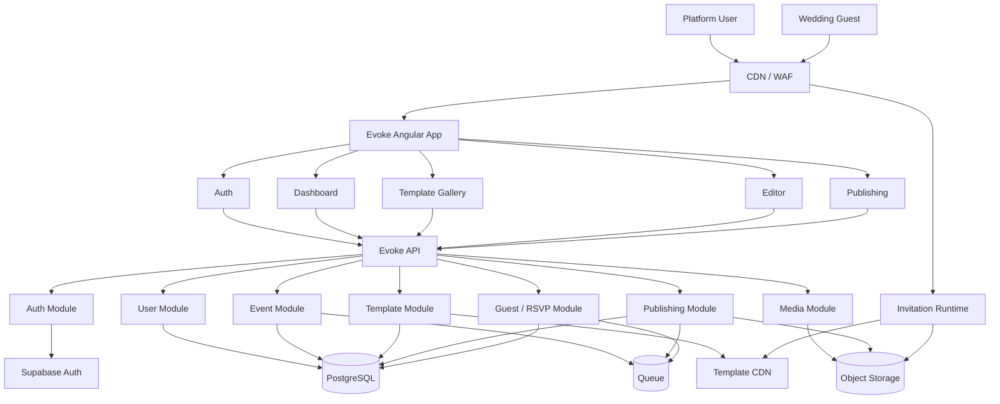

------------------------------------------------------------------------

# 84. Final Contract

The most important contract is:

``` text
                    EVOKE
                      |
        ┌─────────────┴─────────────┐
        |                           |
     FRONTEND                    BACKEND
        |                           |
     Angular                     API
        |                           |
   Feature Store             Domain Modules
        |                           |
   Repository                  PostgreSQL
        |                           |
        └───────────┬───────────────┘
                    |
              DOMAIN CONTRACT
                    |
       ┌────────────┼────────────┐
       |            |            |
     User         Event       Template
       |            |            |
       └────────────┼────────────┘
                    |
                 Draft
                    |
                Publishing
                    |
             Public Invitation
```

------------------------------------------------------------------------

# 85. Architectural Non-Negotiables

1.  Supabase Auth remains the authentication authority (behind the
    `IdentityProvider` abstraction).
2.  Auth Service must remain thin.
3.  Backend owns authorization.
4.  Event/Wedding is the primary business entity.
5.  Editor operates on an Event ID.
6.  Templates are reusable assets.
7.  New templates use explicit bindings.
8.  Template, schema, and protocol versions are independent.
9.  Drafts are mutable.
10. Published versions are immutable.
11. Media is stored outside PostgreSQL.
12. Public invitations do not require Supabase Auth.
13. Public traffic is CDN-oriented.
14. Frontend does not directly access private backend databases.
15. Components do not own backend persistence.
16. Feature stores own feature state.
17. Repository interfaces separate UI state from transport.
18. Backend validates every security-sensitive operation.
19. API contracts are versioned.
20. API errors use a stable error contract.
21. Template contracts are validated in CI.
22. Large media is never transported as base64 through normal draft
    APIs.
23. `postMessage` must use a trusted origin in production.
24. User data must never become executable template code.
25. Do not introduce microservices until there is a measured reason.

------------------------------------------------------------------------

# 86. Readiness Checklist Before Backend Coding

Before implementation begins, confirm:

### Architecture

-   [ ] Backend modular boundaries approved.
-   [ ] Event/Wedding identified as primary entity.
-   [ ] Auth boundary approved.
-   [ ] Template architecture approved.
-   [ ] Publishing model approved.

### API

-   [ ] OpenAPI structure defined.
-   [ ] Authentication endpoints defined.
-   [ ] Event endpoints defined.
-   [ ] Template endpoints defined.
-   [ ] Draft endpoints defined.
-   [ ] Media endpoints defined.
-   [ ] Publishing endpoints defined.
-   [ ] Public endpoints defined.
-   [ ] Error contract defined.

### Database

-   [ ] User model defined.
-   [ ] Event model defined.
-   [ ] Template model defined.
-   [ ] Template version model defined.
-   [ ] Draft model defined.
-   [ ] Media model defined.
-   [ ] Published version model defined.
-   [ ] Guest/RSVP model defined.

### Frontend

-   [ ] Auth Store planned.
-   [ ] Dashboard Store planned.
-   [ ] Event Store planned.
-   [ ] Template Gallery Store planned.
-   [ ] Editor Store retained.
-   [ ] Repository contracts defined.
-   [ ] Editor route planned around event ID.

### Security

-   [ ] Supabase Auth project/client strategy defined.
-   [ ] JWT validation defined.
-   [ ] RBAC defined.
-   [ ] Ownership rules defined.
-   [ ] iframe origin strategy defined.
-   [ ] Upload security defined.
-   [ ] Rate limiting defined.

### Operations

-   [ ] Logging strategy defined.
-   [ ] Trace/request IDs defined.
-   [ ] Metrics defined.
-   [ ] Database migrations defined.
-   [ ] CI/CD defined.
-   [ ] Backup strategy defined.

------------------------------------------------------------------------

# 87. Final Verdict

The current Angular frontend and proposed backend architecture are
**architecturally compatible**, provided the following decisions are
followed during implementation:

``` text
Angular
   |
   +-- Auth Store ----------> Auth API ----------> Supabase Auth
   |
   +-- Dashboard Store -----> Event API ---------> PostgreSQL
   |
   +-- Template Store ------> Template API ------> Template metadata
   |
   +-- Editor Store --------> Draft API ----------> PostgreSQL
   |
   +-- Media ----------------> Media API ---------> Object Storage
   |
   +-- Publishing ----------> Publish API --------> Published Snapshot
   |
   +-- Public Runtime ------> Public API/CDN ----> Published Snapshot
```

The existing frontend does **not** need to wait for backend
implementation to continue with visual/product work.

However, before implementing the backend, the team should treat this
document as the baseline for:

-   API design.
-   Database design.
-   Authentication integration.
-   Template contracts.
-   Draft persistence.
-   Publishing.
-   Media.
-   Public invitation rendering.

The most important architectural transition is:

``` text
CURRENT

Template
   ↓
Editor
   ↓
LocalStorage


TARGET

User
   ↓
Event / Wedding
   ↓
Template Version
   ↓
Editor
   ↓
Draft API
   ↓
Published Version
   ↓
CDN
   ↓
Public Invitation
```

That model aligns the existing Angular frontend with the proposed
backend while preserving the original goal: **a reusable
event-invitation platform where adding the 100th template does not
require rebuilding the application architecture.**
