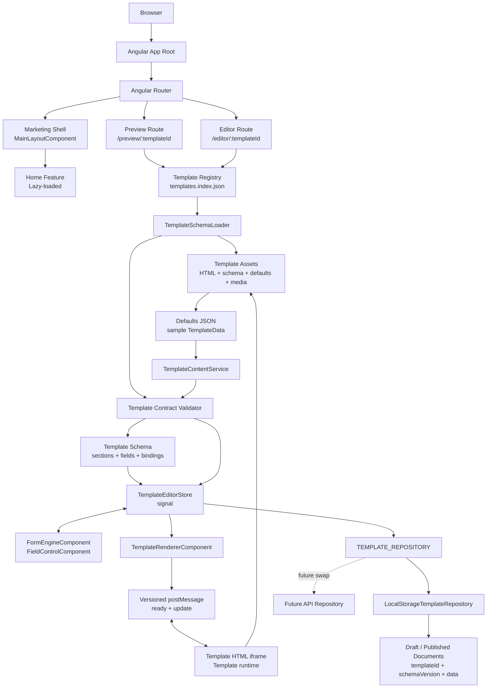

# Evoke — Event Management SaaS Platform

Premium platform for creating personalized **invitation websites**. Phase 1 ships
Wedding & Engagement invitations; the architecture is built to scale into
birthdays, baby showers, corporate events, conferences, and full event-management
services without major refactoring.

Built with **Angular 20** — standalone components, signals, new control flow,
deferrable views, functional guards/interceptors, and strict TypeScript.

---

## Tech stack

| Concern     | Choice                                                        |
| ----------- | ------------------------------------------------------------- |
| Framework   | Angular 20 (standalone, zoneless-ready, OnPush everywhere)    |
| Language    | TypeScript (strict, no `any`)                                 |
| State       | **Signals** for local/UI state · RxJS only for async streams  |
| Styling     | SCSS with a token-driven architecture (`src/styles/`)         |
| Routing     | Angular Router — 100% lazy-loaded, route-level code splitting |
| HTTP        | `provideHttpClient` + functional interceptors                 |
| Quality     | ESLint (angular-eslint), Prettier, Stylelint (BEM)            |
| Git hygiene | Husky + lint-staged + Commitlint (Conventional Commits)       |
| Testing     | Jasmine + Karma (`ng test`)                                   |

---

## Architecture

Feature-based, SOLID, no `SharedModule` (standalone-only).

```
src/
  app/
    core/            # app-wide singletons — imported once
      config/ constants/
      guards/        # functional guards (authGuard)
      interceptors/  # functional interceptors (base-url, auth-token, error)
      layouts/       # MainLayout + Navbar + Footer (global chrome)
      models/        # cross-cutting domain models
      services/      # ThemeService, ViewportService, SeoService, AuthService
      tokens/        # DI tokens (WINDOW — SSR-safe)
    shared/          # reusable, presentational, stateless
      components/    # logo, theme-toggle, section-heading, image-slot,
                     # cta-button, coming-soon, not-found
      directives/    # tilt, magnetic, in-view (IntersectionObserver)
      types/ validators/
    features/        # lazy-loaded feature areas
      home/          # the landing page
        components/  # hero, stats, services, how-it-works, templates,
                     # features, comparison, testimonials, pricing, faq, cta
        data/        # HomeContentService (single source of truth for content)
        models/ pages/ home.routes.ts
      auth/ dashboard/   # scaffolded, lazy, dashboard is authGuard-protected
  styles/            # global SCSS layers
    abstracts/       # tokens, breakpoints, mixins (design tokens live here)
    base/            # reset, fonts, typography, animations
    themes/          # dark/light via CSS custom properties
    utilities/
  environments/      # development / staging / production (typed)
  assets/            # fonts (woff2) + images
```

### Design system

All theme-dependent values are **CSS custom properties** (`--bg`, `--text`,
`--glass-rgb`, `--nav-rgb`, …) defined per-theme in `styles/themes`. Theme
switching is a single `data-theme` attribute write on `<html>` — instant, with
zero component re-rendering. Static design tokens (spacing, radii, shadows,
gradients, typography, breakpoints) live in `styles/abstracts` and are consumed
by components via `@use 'abstracts' as *`.

### Performance

- **Route-level code splitting** — every feature is `loadComponent`/`loadChildren`.
- **Deferrable views** — below-the-fold home sections use `@defer (on viewport)`,
  each emitted as its own lazy chunk (initial transfer ≈ 96 kB).
- **OnPush + signals** everywhere; a single `ViewportService` owns the only
  scroll/resize listeners (passive, `auditTime`-throttled) and exposes signals.
- **IntersectionObserver** (`appInView`) drives counters and reveals — no scroll math.
- Transform/opacity-only animations, `will-change` hints, and full
  `prefers-reduced-motion` support.
- Fonts self-hosted with `font-display: swap` + unicode-range subsetting;
  hero LCP image preloaded.

### Accessibility (WCAG AA)

Semantic landmarks, skip link, ARIA on nav/accordion/carousel, keyboard-operable
controls, visible focus rings, and decorative SVGs marked `aria-hidden`.

### SEO (SSR-ready)

`SeoService` centralises Title, description, OpenGraph, Twitter cards, canonical,
robots, and JSON-LD structured data — all via `Meta`/`Title`/`DOCUMENT` (no
`window`), so enabling Angular SSR later is a drop-in.

---

## Getting started

```bash
npm install
npm start            # dev server → http://localhost:4200
```

### Scripts

| Script                  | Purpose                         |
| ----------------------- | ------------------------------- |
| `npm start`             | Dev server                      |
| `npm run build`         | Production build                |
| `npm run build:staging` | Staging build (env replacement) |
| `npm test`              | Unit tests (Karma/Jasmine)      |
| `npm run lint`          | ESLint (TS + templates)         |
| `npm run lint:styles`   | Stylelint (SCSS)                |
| `npm run format`        | Prettier write                  |

Commits follow **Conventional Commits** (enforced by Commitlint); staged files
are linted/formatted automatically via the Husky `pre-commit` hook.

### Environments

`environment.ts` (dev) is swapped at build time for `environment.staging.ts` /
`environment.production.ts` via `angular.json` file replacements. The shape is
enforced by `AppEnvironment`.

---

## Product architecture

### System architecture diagram

The following diagram shows the runtime relationships between the Angular
application, the template asset package, the editor, persistence, and the
embedded invitation runtime:



The important design boundary is `TemplateEditorStore`: the form and preview do
not maintain separate copies of the user's data. The store is the single source
of truth, while schemas, defaults, template assets, and persistence remain
separate concerns.

Evoke currently has three main product surfaces:

| Surface | Route | Responsibility |
| --- | --- | --- |
| Marketing site | `/` | Explains the product and presents the brand experience. |
| Template preview | `/preview/:templateId` | Shows one invitation template in a full-screen iframe. |
| Template editor | `/editor/:templateId` | Generates an editor form from the selected template's schema and streams changes into the preview. |

Authentication, dashboard, services, template gallery, checkout, and contact routes
are currently scaffolded with `ComingSoonComponent`. Their routes already exist so
they can be implemented without changing the application shell.

The editor and preview routes deliberately sit outside `MainLayoutComponent`. This
keeps the invitation canvas independent from the marketing navigation, footer, and
homepage scene effects.

## Template system overview

Templates are assets, not Angular components. A template consists of:

1. An entry in `public/invitation-templates/templates.index.json`.
2. A rendered HTML file used in the iframe.
3. A schema manifest, either inline in the HTML or in a sibling `.schema.json` file.
4. A defaults JSON file containing sample content.
5. A template runtime that consumes the versioned preview messages.

The normal data flow is:

```text
templates.index.json
        |
        v
TemplateSchemaLoader
        |
        v
validateTemplateSchema()
        |
        v
TemplateEditorStore <---- FormEngineComponent / FieldControlComponent
        |
        +---- TemplateRepository (draft / publish)
        |
        +---- TemplateRendererComponent
                         |
                         v
                  iframe postMessage
                         |
                         v
                  template runtime
```

There is one editor store per editor route because `TemplateEditorStore` is
provided by `EditorPageComponent`. The form and preview therefore read and write
the same signal-backed `TemplateData` object.

## Template registry

The registry is [`public/invitation-templates/templates.index.json`](public/invitation-templates/templates.index.json).
It is fetched at runtime by `TemplateSchemaLoader` and validated before use.

Each entry has this shape:

```json
{
  "id": "tpl-my-template",
  "previewUrl": "/invitation-templates/my-template.html",
  "schemaUrl": "/invitation-templates/my-template.schema.json",
  "bindingMode": "explicit"
}
```

`schemaUrl` is optional. If it is omitted, the loader extracts the schema from an
inline `<script type="application/evoke-schema+json">` block in the HTML.

`bindingMode` is required:

- `explicit` is required for new templates. Every field must declare its binding.
- `legacy` is only for existing templates that still own custom mapping logic.

The registry validates unique IDs, preview URLs, and binding modes. Invalid entries
are rejected loudly in the console instead of producing a partially working picker.

## Schema model

The canonical model is in
[`src/app/features/editor/models/template-schema.model.ts`](src/app/features/editor/models/template-schema.model.ts).

A schema is made of sections and fields:

```json
{
  "id": "tpl-my-template",
  "name": "My Wedding",
  "category": "Wedding",
  "version": 1,
  "defaultsUrl": "/invitation-templates/my-template.defaults.json",
  "bindingMode": "explicit",
  "sections": [
    {
      "key": "couple",
      "label": "Couple",
      "fields": [
        {
          "key": "brideName",
          "label": "Bride's name",
          "type": "text",
          "required": true,
          "binding": "couple.brideName"
        }
      ]
    }
  ]
}
```

Supported field types are `text`, `textarea`, `date`, `image`, `audio`, `toggle`,
`color`, and `list`. A list has an `itemSchema` containing its child fields. This
supports template-specific schedules, galleries, timelines, family groups, and
other repeatable structures without adding Angular components.

The runtime value is shaped as:

```ts
type TemplateData = {
  [sectionKey: string]: {
    [fieldKey: string]: string | boolean | ListItem[];
  };
};
```

The generic form engine renders controls from this schema. It does not know about
individual template names or sections.

## Contract validation

[`template-contract.ts`](src/app/features/editor/data/template-contract.ts) is the
shared runtime validation boundary.

Manifest validation checks:

- object shape and required metadata;
- template ID matches the registry ID;
- positive schema version;
- non-empty sections;
- duplicate section keys;
- duplicate field keys;
- supported field types;
- list fields have child schemas;
- nested list child fields are valid;
- explicit templates have a binding for every field.

Defaults and drafts are checked for:

- unknown section keys;
- unknown field keys;
- invalid scalar types;
- invalid list values;
- invalid list item shapes;
- unknown list child keys.

Validation failures are logged with the template or asset URL and the affected
template is rejected or safely falls back to defaults. Do not replace the casts in
the loader with unchecked `as TemplateSchema` or `as TemplateData` statements.

## Binding contract

The binding contract is the most important rule for scaling templates.

For new templates, `bindingMode` must be `explicit` and every schema field must
declare a stable binding key. The template runtime must consume the same key from
the `TemplateData` payload. A field should never depend on an original sample
string, an image `alt` value, or a positional DOM assumption.

Legacy templates are temporarily allowed to keep custom mapping code. The two
current legacy templates are:

- `tpl-samarpan-royal` — uses `data-ev`, `data-ev-img`, and custom list hooks.
- `tpl-eternal-bond` — uses a bundled runtime with legacy string/alt mapping.

When converting a legacy template, migrate one field at a time to explicit stable
keys, then change its registry entry to `bindingMode: "explicit"`. Do not add new
legacy templates.

## Preview protocol

The editor and iframe communicate through a small versioned protocol defined in
[`preview-protocol.ts`](src/app/features/editor/data/preview-protocol.ts).

The iframe announces readiness:

```json
{ "channel": "evoke:preview-ready", "version": 1 }
```

The editor sends updates only after that handshake:

```json
{
  "channel": "evoke:preview-update",
  "version": 1,
  "data": { "couple": { "brideName": "..." } }
}
```

The editor ignores messages with an unknown channel or protocol version. When the
protocol changes, increment the version and update the editor plus every template
runtime that supports the new version.

For production security, replace the current wildcard `postMessage` target with a
configured trusted origin once templates are served from a known origin.

## Editor state and persistence

`TemplateEditorStore` owns:

- the active schema;
- the current `TemplateData` signal;
- default and draft hydration;
- required-field checks;
- document serialization.

`TemplateRepository` is an injection-token boundary. The current implementation is
`LocalStorageTemplateRepository`, but the editor depends only on the interface:

```text
EditorPageComponent
        |
        v
TEMPLATE_REPOSITORY
        |
        +-- LocalStorageTemplateRepository (current)
        +-- ApiTemplateRepository (future)
```

Draft autosave is debounced by 800 ms and deduplicated against the last persisted
document. A persisted document contains `templateId`, `schemaVersion`, and `data`.

## Draft migration

[`template-migration.service.ts`](src/app/features/editor/data/template-migration.service.ts)
is the migration boundary. It currently validates drafts, rejects drafts for the
wrong template, rejects drafts created by a newer schema, and safely falls back to
defaults when a draft is invalid.

When a schema changes, add an explicit migration before accepting the new version:

```ts
if (document.schemaVersion === 1 && schema.version === 2) {
  // Rename or reshape fields here.
}
```

Never silently reinterpret old data. Every field rename, move, or type change must
have a versioned migration and a test fixture.

## Adding a template

1. Create the HTML runtime in `public/invitation-templates/`.
2. Create a schema JSON file or add an inline manifest.
3. Create a defaults JSON file matching the schema.
4. Add an `explicit` entry to `templates.index.json`.
5. Give every field a unique section/key pair and explicit binding.
6. Implement the versioned ready/update protocol in the HTML runtime.
7. Verify that every field appears in the generated form.
8. Verify that changing every field updates the preview.
9. Verify list add/remove/edit behavior and required validation.
10. Verify a draft reloads and an old-version draft migrates correctly.

Example defaults:

```json
{
  "couple": {
    "brideName": "Diya",
    "groomName": "Aarav"
  }
}
```

The defaults file is sample content only. It should not be used as the binding
contract and should not contain fields absent from the schema.

## Media handling

Images and audio currently pass through the generic field controls. Images are
optimized by `ImageOptimizerService`, but the current draft repository is still
browser storage. Large data URLs can exceed storage limits and make publish
payloads expensive.

The production backend should store media separately and put asset references in
`TemplateData`, for example:

```json
{
  "assetId": "asset_123",
  "url": "https://cdn.example.com/asset_123.webp",
  "kind": "image"
}
```

That change belongs behind the repository/upload boundary and should not require
template-specific editor code.

## Performance and lifecycle rules

- Routes are lazy-loaded with `loadChildren` and `loadComponent`.
- The homepage uses `@defer (on viewport)` for below-the-fold sections.
- Signals and `OnPush` are used for local state and derived UI state.
- `ViewportService` owns shared viewport listeners.
- IntersectionObserver powers in-view and reveal behavior.
- The Three.js scene is deferred, uses one animation loop, caps pixel ratio, and
  disposes GPU resources on destroy.
- The editor preview uses one iframe per editor session and a `ResizeObserver` for
  device viewport scaling.
- Browser APIs are accessed through the SSR-safe `WINDOW` token where applicable.

Avoid adding a scroll listener, animation loop, or global singleton for an
individual template. Template-specific behavior belongs inside the template
runtime and must clean up its listeners, timers, and media resources.

## Security boundaries

- Templates run inside a sandboxed iframe with scripts and same-origin access
  enabled for the current static-asset setup.
- User values must be escaped by the template runtime before being inserted into
  HTML, attributes, styles, or URLs.
- Do not use arbitrary user data as a selector or executable JavaScript.
- Replace wildcard message origins with a trusted configured origin before serving
  templates across origins.
- Move publishing and media upload to a backend before treating localStorage as a
  production data store.

## Testing checklist

Before accepting a template, test:

- valid schema loads;
- malformed schema fails loudly;
- duplicate keys fail;
- defaults with unknown keys fail;
- nested list defaults validate;
- every required field blocks publish when empty;
- every field updates the preview;
- iframe version mismatch is ignored;
- draft reload works;
- wrong-template drafts are rejected;
- older schema drafts migrate;
- newer schema drafts are not silently downgraded;
- image/audio failure does not crash the editor;
- mobile, tablet, laptop, and fit preview modes work.

Run the project checks with:

```bash
npm run build:prod
npx tsc -p tsconfig.app.json --noEmit
npm run lint
npm run lint:styles
npm test
```

## Scaling decision

The current architecture is designed so 100+ templates can share one Angular
editor engine. The scaling unit is the template asset package, not an Angular
feature module. A new template should normally add files under
`public/invitation-templates/` and one registry entry, not new form components or
routes.

The non-negotiable rules for that scale are:

1. New templates use explicit bindings.
2. Schemas and defaults pass runtime validation.
3. Draft changes are versioned and migrated.
4. Media is eventually stored as uploaded assets, not large data URLs.
5. Template runtimes use the versioned preview protocol.
6. Registry and contract tests run in CI.

Following those rules keeps the core editor stable while allowing each template to
have its own sections, field count, list structures, visual design, and runtime
behavior.
